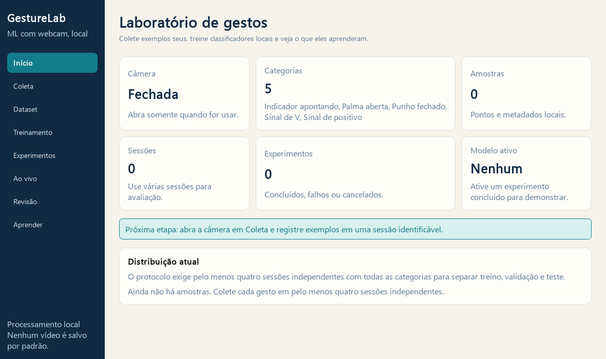

# GestureLab

**Um laboratório local para aprender machine learning com gestos da mão.**

Aplicação desktop em Python, com webcam contínua, coleta supervisionada, comparação de
modelos e revisão de erros. Interface e documentação em português. Processamento local,
sem serviços pagos, API externa de IA ou publicação automática.

> **Software e experimento são coisas diferentes.** A implementação pode ser testada
> com dados sintéticos; a qualidade do reconhecimento depende de você coletar gestos reais
> em sessões independentes. Esta entrega não contém métricas inventadas de reconhecimento.

Validação desta entrega: **27 testes aprovados**, webcam física em 640 × 480 testada,
abertura/reabertura/encerramento confirmados. [Evidências e limites](docs/VALIDACAO.md).



## Abrir agora

Depois de instalar as dependências e o detector, abra **`Iniciar.cmd`**
na pasta do projeto, ou execute:

```powershell
.\.venv\Scripts\python.exe -m gesturelab
```

A câmera começa fechada. Em **Coleta**, selecione o índice `0` e clique para abri-la.
O aplicativo não precisa de internet depois da instalação.

**Pendência de privacidade identificada:** o pacote binário MediaPipe 0.10.35 pode tentar
enviar estatísticas de uso, embora o processamento das imagens seja local. A ausência total
de telemetria ainda exige substituir essa distribuição. [Evidência e alternativas](docs/CORRECAO_COLETA.md).

### Como coletar: câmera aberta não significa gravação

1. Em **Coleta**, clique em **Abrir câmera**.
2. No campo **Gesto**, escolha o rótulo que vai apresentar, por exemplo **Palma aberta**.
   A contagem só fica habilitada depois de escolher o gesto.
3. Clique em **Iniciar contagem (3 s)** e aguarde **3 → 2 → 1**. Mostre uma mão
   inteira e confira o contador **amostras nesta sessão** aumentando.
4. **Pausar coleta** interrompe novas amostras. A câmera continua mostrando a prévia.
   Escolha outro gesto e use **Retomar contagem (3 s)** para continuar na mesma sessão.
5. **Finalizar sessão** encerra a rodada e mantém o total salvo visível. As amostras
   podem ser inspecionadas em **Dataset**, filtradas por sessão. Para desligar a câmera,
   use **Fechar**.

O estado da detecção (mão pronta, sem mão, duas mãos) é exibido separado do estado da
coleta. Se o contador não aumentar, confira se aparece **Coletando** e se há exatamente
uma mão válida no enquadramento. Os botões de pausa e finalização ficam desabilitados
quando ainda não existe uma coleta/sessão para interromper.

## Instalação

Ambiente validado: Windows 10 x64, Python 3.13.14, CPU Intel Core i7-7700HQ.
As versões efetivamente instaladas estão em `requirements.lock`.

Com Git e Python 3.13 x64 instalados, baixe o projeto:

```powershell
git clone https://github.com/dev-matheusfranca/gestosML.git
cd gestosML
```

Na pasta do projeto, execute:

```powershell
powershell -ExecutionPolicy Bypass -File .\Instalar.ps1
```

O script cria `.venv`, instala versões fixadas, instala o projeto localmente e baixa o
Hand Landmarker oficial com hash verificado. O bypass vale apenas para esse processo;
não altera a política global do Windows. Python 3.11/3.12 exigem resolver e validar
dependências compatíveis; o lock fornecido foi validado com Python 3.13 x64.

## Primeiro experimento

1. **Coleta:** abra a câmera; escolha uma categoria e crie a sessão ao iniciar a contagem.
   Colete uma mão por vez. Pause para mudar o gesto; finalize a sessão antes de uma nova rodada.
2. Colete os mesmos gestos em **pelo menos quatro sessões independentes**, variando posição,
   distância e condições. Use todas as classes em cada sessão para facilitar uma divisão válida.
3. **Dataset:** inspecione desenhos dos pontos, revise rótulos, confira duplicatas e crie uma versão.
4. **Treinamento:** escolha a versão, os atributos, o protocolo e os modelos. Os dados são separados
   por grupo; frames da mesma sessão nunca entram em lados distintos da avaliação.
5. **Experimentos:** examine acurácia, macro-F1, matriz de confusão, suporte, cobertura e latência.
   Escolha um modelo concluído para ativar.
6. **Ao vivo:** abra a câmera e experimente a demonstração dentro da aplicação. Marque erros para revisão.
7. **Revisão:** atribua o rótulo correto, crie uma nova versão e avalie a hipótese de melhoria.
   O teste final fica fora desse ciclo e deve ser consultado depois de encerrar as escolhas.

## O que é treinado

```text
Webcam → MediaPipe: 21 pontos → atributos → classificador próprio → pontuação → suavização
```

O MediaPipe localiza pontos usando um componente pré-treinado. O GestureLab treina quatro
classificadores com os exemplos rotulados: Dummy, regressão logística, Random Forest e MLP.
Não usa as categorias de um reconhecedor pronto de gestos.

## Comandos sem interface

Use os IDs retornados pela aplicação ou pelos comandos. Não execute avaliação final durante
a busca de modelos. Erros de dados insuficientes são bloqueios de protocolo, não convite para
dividir frames aleatoriamente.

```powershell
.\.venv\Scripts\python.exe -m gesturelab.cli --data-dir data validate
.\.venv\Scripts\python.exe -m gesturelab.cli --data-dir data snapshot
.\.venv\Scripts\python.exe -m gesturelab.cli --data-dir data datasets
.\.venv\Scripts\python.exe -m gesturelab.cli --data-dir data experiments
.\.venv\Scripts\python.exe -m gesturelab.cli --data-dir data train dataset_SEU_ID --models dummy logistic forest mlp --strategy normalized --protocol session --seed 42
.\.venv\Scripts\python.exe -m gesturelab.cli --data-dir data compare experiment_A experiment_B
.\.venv\Scripts\python.exe -m gesturelab.cli --data-dir data evaluate experiment_ESCOLHIDO
.\.venv\Scripts\python.exe -m gesturelab.cli --data-dir data export exportacao.parquet
```

Experimento opcional de orçamento equivalente, com definição por IDs em JSON:

```powershell
.\.venv\Scripts\python.exe -m gesturelab.improvement experimento.json --data-dir data
```

Veja [protocolo](docs/PROTOCOLO.md), [núcleo](docs/core.md) e [comparação](docs/RELATORIO_COMPARATIVO.md).

`--preset single` executa uma configuração fixa por modelo; `--preset quick` compara a
grade pequena. `Ctrl+C` na CLI solicita cancelamento seguro. Para uma coleta independente
com outro protocolo, escolha outro diretório: `python -m gesturelab --data-dir outra-coleta gui`.

## Validar o software

```powershell
.\.venv\Scripts\python.exe -m pytest -q
.\.venv\Scripts\python.exe -m ruff check gesturelab scripts tests
.\.venv\Scripts\python.exe -m pip check
.\.venv\Scripts\python.exe scripts/probe_runtime.py --camera 0
```

O diagnóstico da câmera é explícito e não salva imagens. Os testes usam diretórios temporários;
não criam um modelo fictício no dataset do usuário. Evidências e pendências: [VALIDACAO.md](docs/VALIDACAO.md).

## Dados e segurança

Dados em `data/`: SQLite, Parquet, versões e modelos locais. O diretório é ignorado pelo Git.
Pontos originais são preservados; imagens e vídeos não são armazenados nesta versão. Use
pseudônimos se precisar agrupar participantes. Não compartilhe dados pessoais na coleta.

Arquivos joblib/pickle podem executar código. O aplicativo carrega apenas artefatos locais
registrados e íntegros, com compatibilidade conferida. Não substitua arquivos por modelos
recebidos de terceiros. Apagar dados atuais não apaga versões históricas e exportações.

## Documentação e portfólio

- [Arquitetura](docs/ARQUITETURA.md) e [detalhes do núcleo](docs/core.md).
- [Guia de aprendizado e exercícios](docs/APRENDIZADO.md).
- [Protocolo de coleta e avaliação](docs/PROTOCOLO.md).
- [Dataset card](docs/DATASET_CARD.md) e [model card](docs/MODEL_CARD.md).
- [Relatório comparativo](docs/RELATORIO_COMPARATIVO.md).
- [Roteiro de vídeo e rascunho LinkedIn](docs/PORTFOLIO.md).
- [Licença MIT](LICENSE) e [componentes de terceiros](THIRD_PARTY_NOTICES.md).

Uma pessoa, uma mão e gestos estáticos. Não é reconhecimento de língua de sinais, identificação
de pessoas ou controle do computador. A aplicação roda localmente; as coletas e os modelos
treinados ficam no computador e não fazem parte do repositório.
