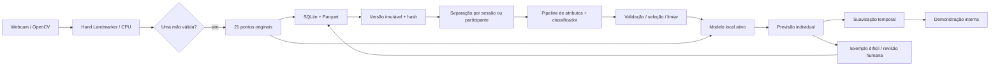

# Arquitetura

## Fluxo

O Hand Landmarker é um **extrator pré-treinado**. O GestureLab treina seus próprios
classificadores supervisionados. Nenhum rótulo vem de um reconhecedor pronto de gestos.

## Fronteiras

| Módulo | Responsabilidade |
| --- | --- |
| `camera.py` | OpenCV, MediaPipe, critérios geométricos, prévia desenhada, liberação dos recursos |
| `features.py` | Atributos versionados, processamento compartilhado por treino e inferência |
| `store.py` | Categorias, sessões, amostras, revisão, versões e histórico |
| `ml.py` | Grupos, treino, seleção, avaliação, persistência e carregamento confiável |
| `inference.py` | Consenso temporal e intervalo entre ações |
| `ui.py` / `ui_widgets.py` | Fluxo desktop pt-BR, trabalhadores e gráficos |
| `cli.py` | Operações numéricas sem interface |

## Concorrência e encerramento

A captura pertence a um `QThread`: tanto `VideoCapture` quanto Hand Landmarker são
criados e encerrados nessa thread. As imagens enviadas por sinal Qt são cópias próprias,
sem ponteiros para memória de um frame já reutilizado. Treinamento usa outro trabalhador
e um evento de cancelamento. A interface continua processando eventos. Não se utiliza
`terminate()` para interromper threads no meio de uma gravação.

O cancelamento de scikit-learn é cooperativo: uma chamada de ajuste já iniciada precisa
retornar antes do encerramento seguro. Os modelos e conjuntos de parâmetros são pequenos.
O fechamento espera o trabalhador terminar, em vez de abandonar recursos ativos.

## Privacidade e confiança

O fluxo normal não faz chamadas de rede. O instalador acessa o índice de pacotes e o
armazenamento oficial do modelo; verifica SHA-256 do detector antes de instalá-lo.
Não há telemetria, API de IA, identificação de pessoas ou controle global do computador.
O banco fica no diretório de dados local. Coordenadas e pseudônimos ainda devem ser tratados
com cuidado; use pseudônimos não identificáveis. Imagens e vídeos não são persistidos nesta versão.

Modelos `joblib` usam pickle e podem executar código durante o carregamento. Abra somente
experimentos produzidos por esta instalação. Um hash detecta corrupção; não torna confiável
um arquivo que alguém malicioso substituiu junto com seus metadados. Não importe modelos arbitrários.

## Limites conhecidos

Uma pessoa, uma mão, gestos estáticos. O eixo z é uma estimativa, não uma medida física
calibrada. Espelhar a prévia não modifica os pontos salvos. Alterações de perspectiva,
orientação, oclusão, iluminação e diferenças entre participantes podem prejudicar o resultado.
Rejeição por pontuação não é um detector universal de gestos desconhecidos.

Detalhes executáveis de atributos e protocolo: [núcleo](core.md).
